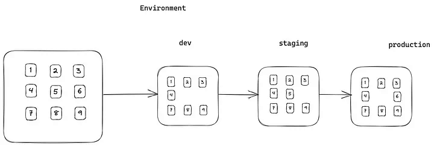
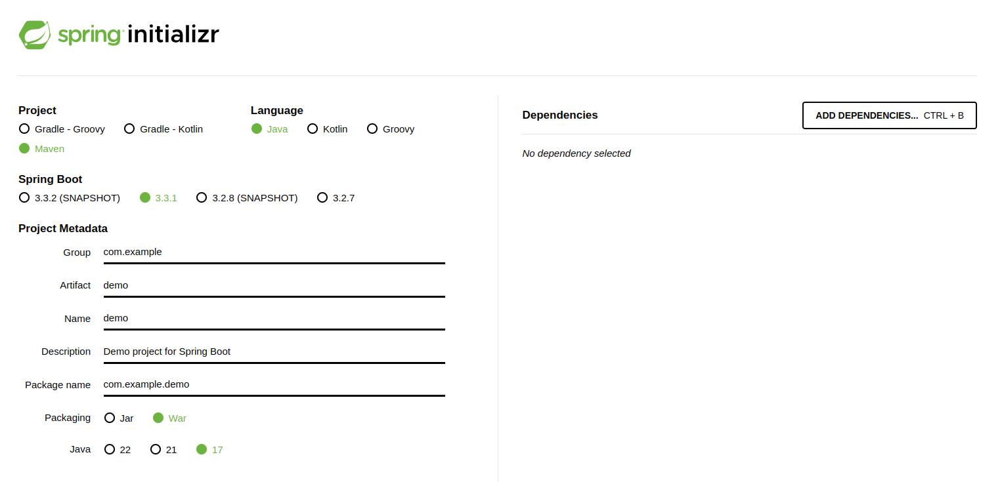

# Spring

# Index

1. [What is Spring Framework?](#what-is-spring-framework)
    1. [Core Features](#core-features)
        1. [IoC (Inversion of Control)](#ioc-inversion-of-control)
        2. [AOP (Aspect Oriented Programming)](#aop-aspect-oriented-programming)
        3. [DAF (Data Access Framework)](#daf-data-access-framework)
        4. [MVC](#mvc)
2. [What is a Spring Bean?](#what-is-a-spring-bean)
3. [Annotations](#annotations)
4. [Dependency Injection](#dependency-injection)
5. [Bean Scoping](#bean-scoping)
6. [Special Spring Environment](#special-spring-environment)
7. [@Value Annotation](#value-annotation)
8. [Best Practices](#best-practices)
    1. [Split Configuration](#split-configuration)
	2. [Spring Initialzr](#spring-initialzr)
9. [Spring Boot](#spring-boot)
    1. [Why Spring Boot?](#why-spring-boot)


# What is Spring Framework?

The Spring Framework is lightweight open source project for building enterprise Java Apps. Aims to simplify complexities that come with an enterprise Java apps.

## Core Features

* IoC (Inversion of Control): Provides a streamlined way to configure and manage Java objects. The framework is responsible of the life cycle of the defined Java object. Use Dependency Injection to provide the object reference during runtime.

* AOP (Aspect Oriented Programming): Provide more modularity, login, cashing, authentication, etc.

* DAF (Data Access Framework): Simplifies the database communication proccess, by providing direct support for poppular data access framework in Java, like JDBC, Hibernate, JPA Api.

* MVC: Allow us to easy create projects with the MVC pattern.

## What is a Spring Bean?

An Spring Bean is an object managed (life cycle, org. dependecies) by the Spring Framework. Spring beans could be configured using xml, Java annotations or Java code.
"In Spring, the objects that form the backbone of your application and that are managed by the Spring IoC container are called beans. A bean is an object that is instantiated, assembled, and otherwise managed by a Spring IoC container."

<p>@Qualifier let us tell Spring which bean to inject. If we don't use it, we may have ambiguity problems with the beans</p>
<p>Nevertheless we can use the @Primary annotation to disambiguate and set 1 bean as a primary bean</p>

<a href=https://www.baeldung.com/spring-bean>@Bean and @Qualifier</a>

### Annotations

<p>@Configuration declares class as full configuration class</p>
<p>@Bean declares bean configuration class. If we put @Bean("examplename") now the name for that Bean is examplename instead of the name of the method</p>


``` java
    @Configuration
    class VehicleFactoryConfig {
    	
		@Bean
    	Engine engine() {
        	return new Engine();
    	}
	
	}
```

<p>@Component marks a class as an Spring Component. As a general component annotation indicates that the class should be initialized, configured and managed by the core container</p>
<p>@Repository annotates classes at the persistence layer, will act as a database repository</p>
<p>@Service annotates classes to indicate that they are holding business logic.</p>
<p>@Controller annotates classic controllers and its typically use with @RequestMapping. Is a specialization of the @Component</p>
<p>@RestController is equivalent than a class with @Controller and @ResponseBody annotation. Every request handling method of the controller class automatically serializes return objects into HttpResponse.</p>
<p>Constructor-dependency injection is automatically done using @Autowired, by injecting the constructor paramenter/s</p>
<p>@Autowired on Constructior is optional if there is only one constructor</p>


### Dependency Injection

Spring Framework provides 4 ways to inject Beans

* Constructor: During bean construction
* Field(Not recommended, only for test)
* Configuration: Configuration Methods
* Setter: Setter Methods Injection

Example without DI
``` java
	public class Store {
		private Item item;
 
    	public Store() {
    	    item = new ItemImpl1();    
    	}
	}
```
Example with DI (Constructor Injection)
``` java
	public class Store {
    	private Item item;

    	public Store(Item item) { // We dont know the object implementation
        	this.item = item;
    	}
	}
``` 
Example with DI (Method Injection)
``` java
	@Service
	public class DefaultPaymentService{
		@Autowired
		public void configureClass(
			AccountRepository accountRepository,
			FeeCalculator feeCalculator
		){
			// Some fancy code
		}
	}
```
### Bean Scoping

* Bean Scope: Life cycle of a Spring Bean and its availability in the context of the app.

* Multiple scopes:
* Life cycle of a Spring Bean (Managed by the Spring Container)

	<ol>
		<li>SINGLETON: This is the default scope, the Spring Container only creates 1 instance and all requests for that bean name will return the same object. Any modifications to this object will be reflected in all references to the bean</li>
		<li>PROTOTYPE: A bean with prototype scope will return a different instance every time is called. It is defined by setting the value prototype to the @Scope("prototype") annotation</li>
		<li>REQUEST: The bean is created for each HTTP request</li>
		<li>SESSION: The bean is created for each HTTP session</li>
		<li>APPLICATION: Is similar to the Singleton scope. In this case, the same instance of the bean is shared across multiple servlet-based applications running in the same ServletContext, while singleton scoped beans are scoped to a single application context only.</li>
		<li>WEBSOCKET: Similar to Singleton scope but limited to a WebSocket session only</li>
	</ol>

	Example of Application Scope
``` java
	@Bean
	@ApplicationScope
	public HelloMessageGenerator(){
		
		applicationScopedBean() {
		return new HelloMessageGenerato();
		}
	
	}
```

### Special Spring Environment

* <p>Environment: We can consider each stage of the app (development/testing/etc) as an environment. In each stage we need a specific environment to work with.</p>
	<p>Sometimes we need to disable some functionalities/infraestructure of the app such as logging, etc. To make this happend we can group bean definitions based on the profile name (Using @Profile("name") / we can also do this coding by the use of AnnotationConfigApplicationContext / in the application.properties).</p>



Example of Environment
``` java
@Configuration
public class AplicationConfig{
	@Autowired
	final Environment environment;
	@Bean
	public PaymentService paymentService(){
		var profile = Profiles.of("cloud");
		var isOkay = this.environment.acceptsProfiles(profile);
		this.environment.getProperty("data.driver");
		return ...
	}
}
```
Example of Profile
``` java
@Service
@Profile("cloud")
public class DefaultPaymentService implements PaymentService{}
```

### @Value Annotation

This annotation is commonly used to inject values into a variable, no matter the type.

Example of use
``` java
@Configuration
@PropertySource("classpath:database.properties") //Our source for @Value
public class ApplicationConfig{
	@Value("${jdbc.url}")
	private String url;
	@Value("${jdbc.username}")
	private String username;
	@Bean
	public DataSource dataSource(){
		return ...;
	}
}
```

## Best Practices

### Split Configuration

Example
``` java
@Configuration
public class ServiceConfig{
	@Bean
	public PaymentService paymentService(){return new ...}
}

@Configuration
public class RepositoryConfig{
	@Bean
	public AccountRepository accountRepository(){return new ...}
}

@Configuration
@Import({ServiceConfig.class, RepositoryConfig.class})
public class AppConfig{
	@Bean
	public DataSource dataSource(){ ... }
}
```

### Spring Initialzr




## Spring Boot
* Spring boot is an approach to develop Spring based apps with very less or no configurations. 
* Spring boot provides a set of starter

### Why Spring Boot?
<ol>
<li>Standalone Apps</li>
<li>Embedded Server(Such as Tomcat or Jetty)</li>
<li>Starters</li>
<li>Auto Configuration</li>
<li>Production Ready Feature</li>
<li>No Xml configuration</li>
</ol>

